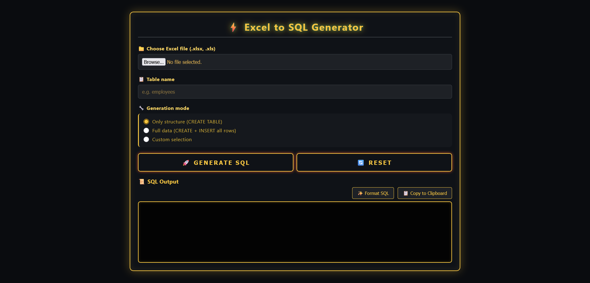
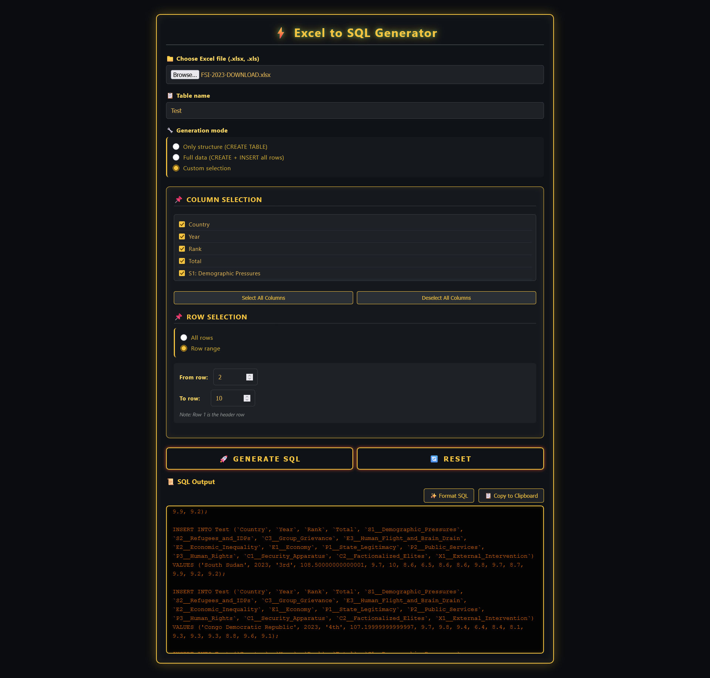
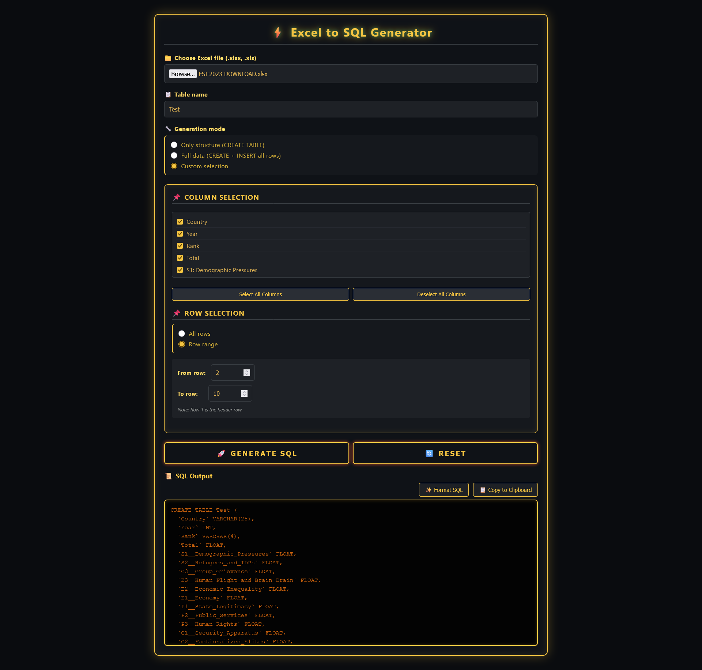

# 📊 Excel to SQL Query Generator – Firefox Extension

[](https://addons.mozilla.org/en-GB/firefox/addon/sql-query-generator/)
[](https://www.mozilla.org/firefox/)
[](https://www.mozilla.org/firefox/android/)
[](LICENSE)

Generate SQL `CREATE TABLE` and `INSERT` statements directly from Excel files – all locally, no data ever leaves your device. Perfect for developers, DBAs, and data analysts who need to quickly convert spreadsheets into database-ready queries.




## ✨ Features

- **📁 Load Excel Files** – Supports `.xlsx` and `.xls` formats.
- **🧠 Smart Type Detection** – Automatically infers SQL data types:
  - `INT` (whole numbers)
  - `FLOAT` (decimals)
  - `DATE` (dates in various formats)
  - `VARCHAR(n)` / `TEXT` (strings, with length estimation)
- **🎯 Flexible Extraction Modes**:
  - **Only structure** – Generate just the `CREATE TABLE` statement.
  - **Full data** – `CREATE TABLE` + `INSERT` statements for every row.
  - **Custom selection** – Choose specific columns and/or row ranges (e.g., rows 2–10, 20–40).
- **✨ SQL Formatting** – One‑click formatting with proper indentation.
- **📋 Copy to Clipboard** – Easily paste the generated SQL anywhere.
- **🔄 Reset Button** – Clear all inputs and start over.
- **📱 Mobile Optimised** – Works on Firefox for Android (opens in a new tab).
- **🔒 Privacy First** – All processing happens **locally** – no data is ever sent to any server.
- **⚡ Opens in a New Tab** – Provides ample space to work with large Excel files.


## 🖼️ Screenshots

<!-- <div style="display: flex; flex-wrap: wrap; gap: 20px; justify-content: center; align-items: center; margin: 20px auto; max-width: 1000px;">
  
  
</div> -->
<div style="display: flex; flex-wrap: wrap; gap: 10px; justify-content: center;">
  
  
</div>


## 📦 Installation

### From Firefox Add‑ons (AMO)
1. Visit the [add‑on page](https://addons.mozilla.org/en-GB/firefox/addon/sql-query-generator/) (link will be active after submission).
2. Click **Add to Firefox**.
3. The extension will open in a new tab when you click its toolbar icon.

### Manual Installation (for development)
1. Clone this repository or download the source.
2. Open Firefox and go to `about:debugging`.
3. Click **This Firefox** → **Load Temporary Add‑on**.
4. Select the `manifest.json` file from the extension folder.
5. The extension icon will appear in the toolbar – click it to open.

### For Android (Firefox Nightly)
1. Enable USB debugging on your Android device.
2. Install `web-ext` globally: `npm install --global web-ext`
3. In the extension folder, run:  
   `web-ext run --target=firefox-android`
4. Select your device when prompted. Firefox Nightly will open with the extension installed.


## 🚀 How to Use

1. **Click the extension icon** – it opens in a new tab.
2. **Choose an Excel file** (`.xlsx` or `.xls`).
3. **Enter a table name** (e.g., `employees`).
4. **Select generation mode**:
   - **Only structure** – just the `CREATE TABLE` statement.
   - **Full data** – `CREATE TABLE` + `INSERT` statements for all rows.
   - **Custom selection** – pick specific columns and/or row ranges.
5. **Click "Generate SQL"**.
6. **Format** the SQL (optional) or **Copy** to clipboard.
7. Use the **Reset** button to clear everything and start over.


## 🛠️ Development

### Prerequisites
- Firefox browser (for testing)
- (Optional) `web-ext` for running on Android

### Structure
```
excel-to-sql/
├── manifest.json          # Extension manifest (MV2)
├── background.js          # Opens the main page in a new tab
├── popup.html             # Main interface
├── popup.css              # Cyber gold theme, mobile responsive
├── popup.js               # Core logic (Excel parsing, SQL generation)
├── xlsx.full.min.js       # SheetJS library (loaded locally)
└── icons/                 # Extension icons (16,32,48,128 PNGs)
```

### Key Dependencies
- **[SheetJS (xlsx)](https://sheetjs.com/)** – Used for parsing Excel files. Loaded locally, no external calls.

### Building / Packaging
To create a distributable `.xpi` file:
```bash
web-ext build
```
The built package will be in the `web-ext-artifacts/` folder.


## 🔒 Privacy

This extension **does not collect, store, or transmit any personal data**.  
- All file processing happens entirely **in your browser**.  
- No analytics, no tracking, no external network requests.  
- The `xlsx` library is bundled locally – no CDN calls.  
- The `data_collection_permissions` in `manifest.json` is set to `"required": ["none"]`, which is verified by Firefox.


## 📄 License

This project is licensed under the **MIT License** – see the [LICENSE](LICENSE) file for details.

The included `xlsx.full.min.js` is Copyright (c) SheetJS and licensed under the **Apache License 2.0**.


## 🙏 Acknowledgements

- [SheetJS](https://sheetjs.com/) – for the excellent Excel parsing library.
- [Mozilla](https://developer.mozilla.org/) – for the comprehensive extension documentation.
- All contributors and users who provide feedback.


## 🤝 Contributing

Contributions, issues, and feature requests are welcome!  
Feel free to check the [issues page](https://github.com/yourusername/excel-to-sql/issues).

1. Fork the project.
2. Create your feature branch (`git checkout -b feature/AmazingFeature`).
3. Commit your changes (`git commit -m 'Add some AmazingFeature'`).
4. Push to the branch (`git push origin feature/AmazingFeature`).
5. Open a Pull Request.


## 📬 Contact

**Author:** [onyxwizard](https://github.com/onyxwizard)  

**Project Link:** [https://github.com/onyxwizard/excel-to-sql](https://github.com/onyxwizard/excel-to-sql-query-extractor)

**Firefox Add‑on Page:** [Excel to SQL Query Generator](https://addons.mozilla.org/en-GB/firefox/addon/sql-query-generator/)


<p align="center">⭐ If you find this extension useful, please consider giving it a star on GitHub! ⭐</p>
